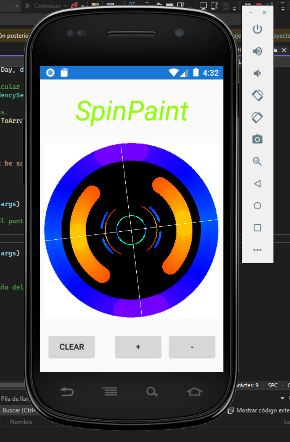

# SpinPaint

SpinPaint es una aplicación Xamarin.Forms que permite a los usuarios dibujar y pintar en un lienzo utilizando sus dedos. Este archivo README.md proporciona información sobre los cambios recientes realizados en la aplicación.

# Cambios

## Modificación del Diseño de los Botones
En el archivo MainPage.xaml, el diseño de los botones ha sido modificado para incluir dos botones adicionales que permiten ajustar el tamaño del puntero. Los botones "Clear" permanecen en la primera fila, mientras que se han agregado los botones "Aumentar Tamaño" y "Disminuir Tamaño" en la segunda fila. Este cambio mejora la organización de los botones para una interfaz de usuario más intuitiva.

## Mejora de la Alineación de los Botones
Para garantizar una alineación adecuada de todos los botones, la propiedad HorizontalOptions para el StackLayout que contiene los botones "Aumentar Tamaño" y "Disminuir Tamaño" se ha establecido en "CenterAndExpand". Este ajuste asegura que los cuatro botones estén alineados horizontalmente y centrados dentro del diseño.

## Cambio en el Tamaño del Puntero
Se ha añadido la capacidad de ajustar el tamaño del puntero en la aplicación. Los botones "Aumentar Tamaño" y "Disminuir Tamaño" permiten a los usuarios aumentar o disminuir el grosor del puntero, respectivamente. Este cambio mejora la experiencia de dibujo al proporcionar opciones para personalizar el trazo según las preferencias del usuario.

## Integrantes
Roberto Chacón, Kevin Moreno

## Imagen

